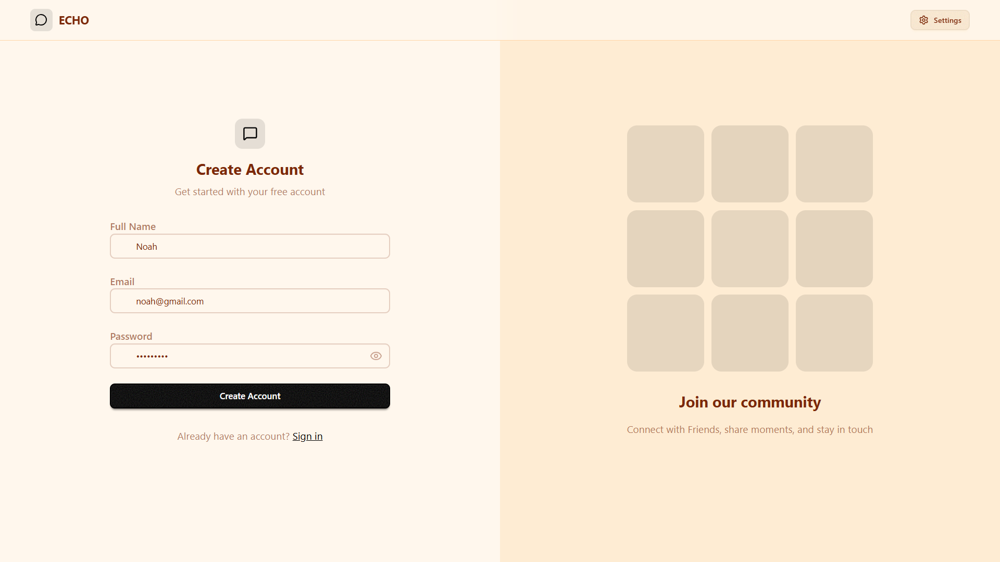
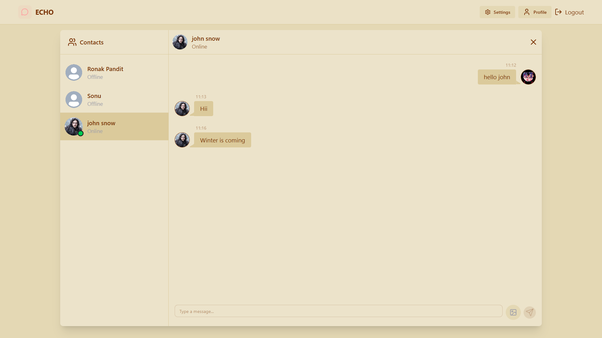
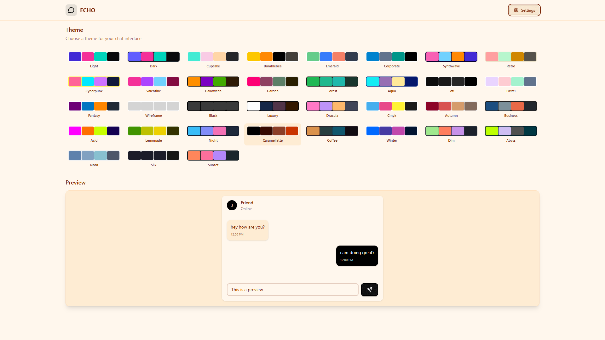

# 🔊 ECHO — Real-Time Chat App

ECHO is a full-stack, real-time messaging platform built on the **MERN stack** with **Socket.io**. It supports live one-on-one messaging, online presence tracking, image sharing, and profile customization — all wrapped in a responsive, themeable UI.

** Live Demo:** [echo-chat-app-2-10xm.onrender.com](https://echo-chat-app-2-10xm.onrender.com)
** Repository:** [github.com/Ashish-Saxena1/ECHO-chat-app](https://github.com/Ashish-Saxena1/ECHO-chat-app)

>  Deployed on Render's free tier — the server may take 30–60 seconds to spin up on first load if it's been idle.

---

##  Screenshots

<!--
Add your screenshots here. Create a `screenshots/` folder in the repo root,
drop your images in it, and update the paths below.
-->

| Login | Chat | Settings |
|---|---|---|
|  |  |  |

---

##  Features

- **Real-time messaging** — instant message delivery powered by Socket.io, no page refresh needed
- **Online presence** — see which users are currently online
- **Secure authentication** — JWT-based auth with HTTP-only cookies and bcrypt password hashing
- **Image sharing in chat** — send images alongside text messages via Cloudinary
- **Profile management** — update your profile picture and details
- **Theme switcher** — multiple UI themes powered by DaisyUI
- **Responsive UI** — works across desktop and mobile screen sizes

---

##  Tech Stack

**Frontend**
- React 19 + Vite
- Tailwind CSS + DaisyUI
- Zustand (state management)
- React Router
- Axios
- Socket.io Client
- React Hot Toast · Lucide Icons

**Backend**
- Node.js + Express 5
- MongoDB + Mongoose
- Socket.io
- JWT (jsonwebtoken) + bcryptjs
- Cloudinary (image uploads)
- Cookie-parser · CORS · Dotenv

**Deployment**
- Render (single web service serving both API and built frontend)

---

##  Project Structure

```
ECHO-chat-app/
├── Backend/
│   ├── src/
│   │   ├── controllers/    # auth & message logic
│   │   ├── lib/            # db, socket.io, cloudinary, utils
│   │   ├── middleware/     # route protection
│   │   ├── models/         # User & Message schemas
│   │   ├── routes/         # /api/auth, /api/messages
│   │   └── index.js        # server entry point
│   └── package.json
├── Frontend/
│   ├── src/
│   │   ├── components/     # Navbar, Sidebar, ChatContainer, etc.
│   │   ├── pages/          # Login, SignUp, Home, Profile, Settings
│   │   ├── Store/          # Zustand stores (auth, chat, theme)
│   │   └── Lib/            # axios instance, utils
│   └── package.json
└── package.json             # root build/start scripts
```

---

##  Getting Started Locally

### Prerequisites

- Node.js (v18+ recommended)
- A MongoDB database (local or [MongoDB Atlas](https://www.mongodb.com/atlas))
- A [Cloudinary](https://cloudinary.com/) account (for image uploads)

### 1. Clone the repo

```bash
git clone https://github.com/Ashish-Saxena1/ECHO-chat-app.git
cd ECHO-chat-app
```

### 2. Set up environment variables

Create a `.env` file inside the `Backend/` folder:

```env
PORT=5001
MONGODB_URI=your_mongodb_connection_string
JWT_SECRET=your_jwt_secret
NODE_ENV=development

CLOUDINARY_NAME=your_cloudinary_cloud_name
CLOUDINARY_API_KEY=your_cloudinary_api_key
CLOUDINARY_API_SECRET=your_cloudinary_api_secret
```

### 3. Install dependencies

```bash
# From the root directory
npm run build
```

This installs dependencies for both `Backend/` and `Frontend/` and builds the frontend.

Or install each separately for development:

```bash
cd Backend && npm install
cd ../Frontend && npm install
```

### 4. Run the app

**Backend (dev mode with nodemon):**
```bash
cd Backend
npm run dev
```

**Frontend (dev server):**
```bash
cd Frontend
npm run dev
```

The frontend runs on `http://localhost:5173` and the backend on `http://localhost:5001` (or whatever `PORT` you set).

### 5. Production build

```bash
npm run build   # from root — builds frontend, installs backend deps
npm start       # from root — starts the Express server, which also serves the built frontend
```

---

##  API Overview

**Auth Routes** — `/api/auth`
| Method | Endpoint | Description |
|---|---|---|
| POST | `/signup` | Register a new user |
| POST | `/login` | Log in |
| POST | `/logout` | Log out |
| PUT | `/update-profile` | Update profile picture (protected) |
| GET | `/check` | Check current auth session (protected) |

**Message Routes** — `/api/messages`
| Method | Endpoint | Description |
|---|---|---|
| GET | `/users` | Get all users for the sidebar (protected) |
| GET | `/:id` | Get chat history with a specific user (protected) |
| POST | `/send/:id` | Send a message to a specific user (protected) |

All protected routes require a valid JWT sent via an HTTP-only cookie.

---

##  Author

**Ashish Saxena**
GitHub: [@Ashish-Saxena1](https://github.com/Ashish-Saxena1)
